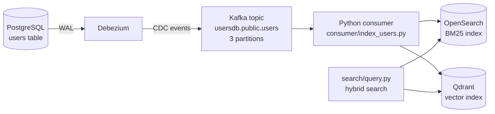

# Architecture

## Overview

This repo demonstrates near-real-time indexing from an OLTP database into two
different search backends — a lexical/BM25 index (OpenSearch) and a semantic
vector index (Qdrant) — via change data capture (CDC), instead of periodic
batch reindexing. A hybrid search layer queries both and fuses the results.

Every change to Postgres's `users` table (insert, update, delete) is captured
by Debezium, streamed through Kafka, and applied to both OpenSearch and
Qdrant by a Python consumer — typically within one to a few seconds of the
original commit.

## Data flow

### PostgreSQL

The `users` table has **no database trigger**. `updated_at` is set explicitly
by whatever writes to the row (see `benchmarking/write-benchmarking.py`'s
`perform_update`, which does `updated_at = NOW()` in the `UPDATE` statement
itself). This is called out deliberately: an earlier version of the
benchmarking tooling assumed a trigger existed, which made the replication
checks pass or fail based on stale pre-existing timestamps rather than real
CDC latency.

### Debezium

Captures the Postgres write-ahead log and publishes change events to Kafka.
Configuration: `connector/users-connector.json` (snapshot mode `initial`,
logical replication slot/publication, no schema-history side effects beyond
the internal Connect topics).

### Kafka

Topic `usersdb.public.users`, 3 partitions (`kafka/docker-compose.yml`). The
broker exposes two listeners: an internal one (`kafka:9092`) for other
containers on the same Docker network (Debezium uses this), and an external
one (`kafka:9094` at boot, reachable as `localhost:9094`) for clients running
on the host machine, which can't resolve the `kafka` hostname otherwise.

### Consumer (`consumer/index_users.py`)

Reads Debezium events and applies them to both search backends:

- **At-least-once processing**: the Kafka offset is only committed after
  both the OpenSearch and Qdrant writes for a message succeed. Any exception
  aborts the process without committing, so the message is redelivered after
  restart. Both writes are idempotent upserts, so redelivery is safe.
- **Concurrent writes**: OpenSearch and Qdrant are independent of each other,
  so each message's two writes run concurrently (a small thread pool), not
  sequentially.
- **Stage-latency telemetry**: each processed message appends one JSON line
  to `logs/cdc_timings.jsonl` (path configurable via `CDC_TIMINGS_LOG`),
  recording Postgres→Debezium capture time, Debezium→consumer delivery time,
  and OpenSearch/Qdrant network vs. server-side time each. The write
  benchmark reads this log back to build its stage-by-stage report.
- **Horizontal scaling**: `run/consumer.sh --instances N` runs N processes in
  the same Kafka consumer group; Kafka's own group-rebalancing protocol
  splits the topic's partitions across them automatically, with no code
  changes needed. The natural ceiling is the partition count (3 today).

### Search layer (`search/query.py`)

Hybrid retrieval: BM25 (OpenSearch, top 50) and semantic search (Qdrant,
top 50, embeddings generated server-side), fused via weighted Reciprocal
Rank Fusion (BM25 weight 0.6, semantic weight 0.4, `k=60`) down to a top 10.

### Benchmarking (`benchmarking/`)

- `load_generator.py` — a shared open-loop load dispatcher: attempts are
  issued on a fixed schedule using a pool of concurrent workers, so the
  *issue rate* is decoupled from how long any individual call takes. Both
  benchmarks previously used a closed-loop design (issue the next attempt
  only after the previous one finished), which silently capped the
  achievable rate at roughly `1 / average call latency` regardless of what
  rate was requested.
- `write-benchmarking.py` — generates Postgres `UPDATE` load at a target
  rate/concurrency and reports write latency, CDC replication latency, and
  the consumer's stage-by-stage breakdown.
- `read-benchmarking.py` — generates hybrid-search query load and reports
  BM25/semantic/RRF/end-to-end latency.

## Known limitations / load-tested findings

These were found by actually load-testing the pipeline, not just reasoning
about the code. Recorded here so they don't need rediscovering:

- **`search/query.py`'s `query()` calls OpenSearch then Qdrant sequentially**,
  not concurrently. This inflates each query's own latency (roughly by
  however long the second call takes) and, under load-testing, understates
  how much concurrent pressure is actually reaching OpenSearch — a slow
  first call holds a worker/concurrency slot for longer than necessary,
  reducing the true dispatch rate at a given `--concurrency`. Diagnosed this
  session; not yet fixed.
- **OpenSearch has a low concurrent-query ceiling on this deployment** — real
  read timeouts were observed above roughly 20 concurrent BM25 queries, with
  latency degrading sharply past that point (see `docs/read-benchmarking.md`).
  This is a cluster-sizing/capacity decision, not a code defect.
- **The consumer's per-instance throughput ceiling is roughly 1-3 updates/sec.**
  Sustained write load much above `~3 × instance count` builds a real,
  measurable backlog in Kafka (demonstrated at 100 updates/sec against 3
  consumer instances — see `docs/write-benchmark.md`).
- **No retry/backoff in the consumer.** A transient network error (e.g. one
  OpenSearch read timeout) crashes the entire process; it needs a manual
  restart rather than recovering on its own.
- **A small clock skew exists between the Debezium container and the
  Postgres host** (order of a few hundred milliseconds), which occasionally
  shows up as a negative "Postgres commit → Debezium capture" stage value.
  It's a measurement quirk in that one stage, not a sign of incorrect
  replication.

## Benchmark reports

- `docs/write-benchmark.md` — write/CDC path at 100 updates/sec for 5
  minutes: the writer hit its target rate almost exactly (dispatch is no
  longer the bottleneck), while the CDC pipeline's own throughput ceiling
  produced a large, honestly-reported backlog.
- `docs/read-benchmarking.md` — hybrid search at a requested 100 queries/sec:
  surfaced OpenSearch's concurrent-query ceiling directly (timeouts and
  latency blowing out well before 100 qps was reached).
