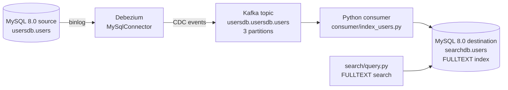

# Architecture

## Overview

This repo demonstrates near-real-time replication from a MySQL 8.0 OLTP
database into a separate MySQL 8.0 destination via change data capture
(CDC), instead of periodic batch reindexing. The destination table carries
a FULLTEXT index, and a query layer serves natural-language searches from it.

Every change to the source `users` table (insert, update, delete) is captured
from the MySQL binlog by Debezium, streamed through Kafka, and upserted into
the destination by a Python consumer — typically within one to a few seconds
of the original commit.

## Data flow

### MySQL source (`mysql-source`)

`mysql:8.0` container (host port 3306) running with row-based binlogging
(`--log-bin --binlog_format=ROW --binlog_row_image=FULL`), which the
Debezium MySQL connector requires. Init SQL
(`kafka/mysql/source-init/01-init.sql`) creates `usersdb.users` (columns
mirror `data/jobseekers_10000.csv`, `DATETIME(6)` timestamps) plus two
users: `debezium` (replication privileges) and `writer` (SELECT/UPDATE on
`users`, used by the write benchmark).

The `users` table has **no database trigger**. `updated_at` is set
explicitly by whatever writes to the row (see
`benchmarking/write-benchmarking.py`'s `perform_update`, which does
`updated_at = NOW(6)` in the `UPDATE` statement itself, then reads the
committed value back with a follow-up `SELECT` — MySQL 8.0 has no
`RETURNING` clause). This is called out deliberately: an earlier version
of the benchmarking tooling assumed a trigger existed, which made the
replication checks pass or fail based on stale pre-existing timestamps
rather than real CDC latency.

### Debezium

Reads the source's binlog and publishes change events to Kafka.
Configuration: `kafka/connector/users-connector.json` (`MySqlConnector`,
snapshot mode `initial` — on a fresh Kafka (no stored offsets) the full
`users` table is snapshotted as `r` events first, so the destination starts
as a complete copy; after that only binlog changes stream).

### Kafka

Topic `usersdb.usersdb.users`, 3 partitions (`kafka/docker-compose.yml`).
The broker exposes two listeners: an internal one (`kafka:9092`) for other
containers on the same Docker network (Debezium uses this), and an external
one (`localhost:9094`) for clients running on the host machine, which can't
resolve the `kafka` hostname otherwise.

### Consumer (`consumer/index_users.py`)

Reads Debezium events and applies them to the destination MySQL:

- **At-least-once processing**: the Kafka offset is only committed after
  the destination write for a message succeeds. Any exception aborts the
  process without committing, so the message is redelivered after restart.
  The write is an idempotent `INSERT ... ON DUPLICATE KEY UPDATE`
  (or `DELETE`), so redelivery is safe.
- **Stage-latency telemetry**: each processed message appends one JSON line
  to `logs/cdc_timings.jsonl` (path configurable via `CDC_TIMINGS_LOG`),
  recording source→Debezium capture time, Debezium→consumer delivery time,
  and the destination upsert time. The write benchmark reads this log back
  to build its stage-by-stage report.
- **Horizontal scaling**: `run/consumer.sh --instances N` runs N processes in
  the same Kafka consumer group; Kafka's own group-rebalancing protocol
  splits the topic's partitions across them automatically, with no code
  changes needed. The natural ceiling is the partition count (3 today).

### MySQL destination (`mysql-dest`)

`mysql:8.0` container (host port 3307). Init SQL
(`kafka/mysql/dest-init/01-init.sql`) creates `searchdb.users` with a
FULLTEXT index over `job_title, skills, bio, company, location`, plus the
`consumer` user (SELECT/INSERT/UPDATE/DELETE on `searchdb.*`).

### Search layer (`search/query.py`)

FULLTEXT retrieval: `MATCH(job_title, skills, bio, company, location)
AGAINST (... IN NATURAL LANGUAGE MODE)`, top 10 by relevance score.
Each worker thread gets its own PyMySQL connection (thread-local), so the
read benchmark can query concurrently.

### Benchmarking (`benchmarking/`)

- `load_generator.py` — a shared open-loop load dispatcher: attempts are
  issued on a fixed schedule using a pool of concurrent workers, so the
  *issue rate* is decoupled from how long any individual call takes. Both
  benchmarks previously used a closed-loop design (issue the next attempt
  only after the previous one finished), which silently capped the
  achievable rate at roughly `1 / average call latency` regardless of what
  rate was requested.
- `write-benchmarking.py` — generates MySQL `UPDATE` load against the
  source at a target rate/concurrency and reports write latency, CDC
  replication latency (polled against the destination), and the consumer's
  stage-by-stage breakdown.
- `read-benchmarking.py` — generates FULLTEXT query load and reports
  FULLTEXT/end-to-end latency.

## Differences from the original PostgreSQL pipeline

- Source: PostgreSQL WAL → **MySQL 8.0 binlog** (`MySqlConnector`).
- Destinations: OpenSearch (BM25) + Qdrant (vector) → **a single MySQL 8.0
  table with a FULLTEXT index**. MySQL 8.0 has no native vector type
  (arrived in MySQL 9.0), so the semantic leg was dropped rather than
  emulated.
- Query layer: hybrid BM25 + semantic with weighted RRF → **FULLTEXT
  natural-language search**; the RRF fusion stage is gone.

## Known limitations

- **No retry/backoff in the consumer.** A transient error (e.g. the
  destination restarting) crashes the entire process; it needs a manual
  restart rather than recovering on its own.
- **A small clock skew can exist between the Debezium container and the
  MySQL source** (order of a few hundred milliseconds), which occasionally
  shows up as a negative "source commit → Debezium capture" stage value.
  It's a measurement quirk in that one stage, not a sign of incorrect
  replication.
- FULLTEXT natural-language mode ignores rows matching >50% of the table
  (the classic MySQL fulltext threshold) and has a minimum word length of
  3 by default (`innodb_ft_min_token_size`) — short tokens in queries
  silently don't match.

## Benchmark reports

The reports under `docs/` (`write-benchmark.md`, `read-benchmarking.md`)
were captured against the original PostgreSQL → OpenSearch/Qdrant pipeline
and are kept for history; rerun the benchmarks to produce MySQL numbers.
